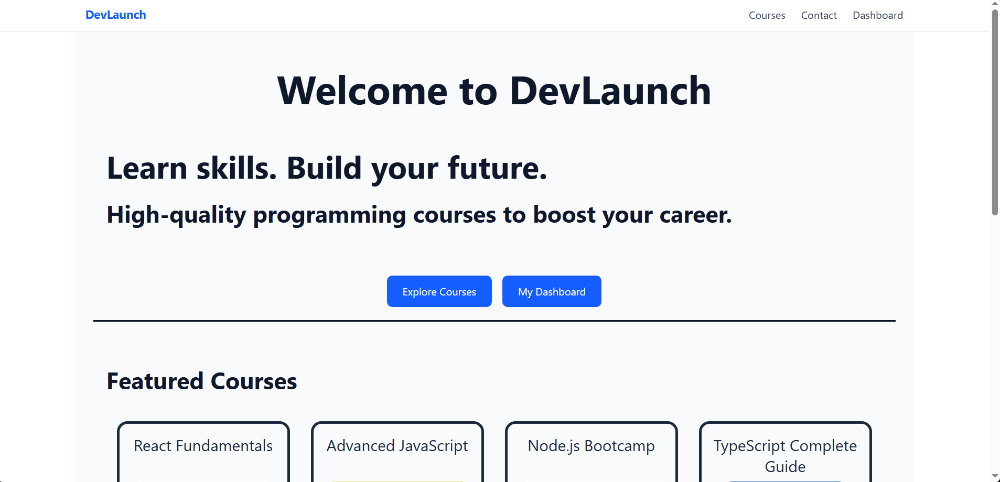
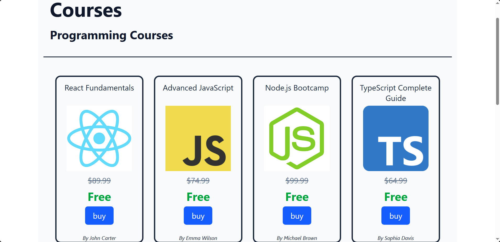
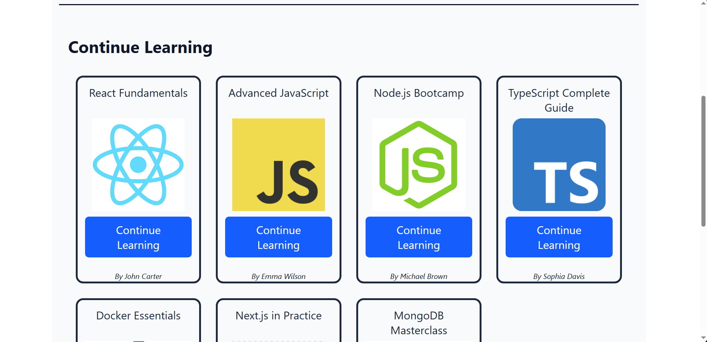

# DevLaunch

A modern React-based learning platform built for portfolio purposes.

## Features

- Browse programming courses
- View course details and lessons
- Mark lessons as completed
- Track progress per course
- Dashboard with enrolled courses
- Contact form (frontend only)
- Responsive UI

## Tech Stack

- React
- React Router
- Context API
- Tailwind CSS
- JavaScript (ES6+)

## How to run

git clone https://github.com/your-username/devlaunch
cd devlaunch
npm install
npm run dev

## Folder Structure

src/
├── assets/
│ └── images/
│
├── components/
│
├── pages/
│
├── context/
│
├── layouts/
│
├── routes/
│
├── data/
│
├── utils/
│
├── styles/
│
└── App.jsx

## Future Improvements

- Dark mode toggle
- Course search system
- Backend integration
- Authentication system

## Screenshots

### Home

### Courses

### CourseDetails

### Dashboard

